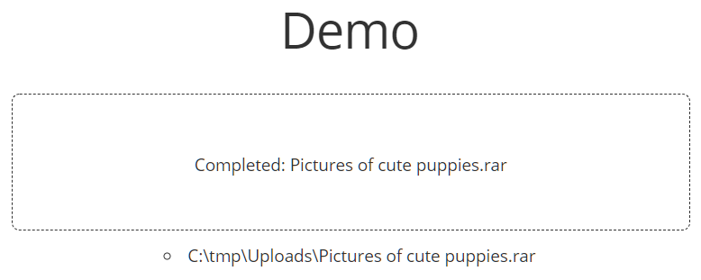

# 📤 dash-uploader

The upload package for [Dash](https://dash.plotly.com/) applications using large data files. 


## Short summary
&nbsp;&nbsp;&nbsp;&nbsp;&nbsp; 💾 Data file size has no limits. (Except the hard disk size)<bR>
&nbsp;&nbsp;&nbsp;&nbsp;&nbsp; ☎ Call easily a callback after uploading is finished.<br>
&nbsp;&nbsp;&nbsp;&nbsp;&nbsp; 📦 Upload files using [resumable.js](https://github.com/23/resumable.js) rather than the HTML5 API, since the [dcc.Upload](https://dash.plotly.com/dash-core-components/upload) of the Dash core has limitations for file size (see [this](https://community.plotly.com/t/chrome-crashes-on-uploading-large-files/7530), [this](https://community.plotly.com/t/upload-a-file-larger-than-800-gb/34995/3) and [this](https://community.plotly.com/t/dash-upload-component-decoding-large-files/8033/2))
<br>
&nbsp;&nbsp;&nbsp;&nbsp;&nbsp; ✅ Works with Dash 0.11.0. & Python 3.7.2. Possibly with many other versions, too.
# Usage
## Simple example

```python
import dash
import dash_html_components as html
import dash_uploader as du

app = dash.Dash(__name__)

# 1) configure the upload folder
du.configure_upload(app, r"C:\tmp\Uploads")

# 2) Use the Upload component
app.layout = html.Div([
    du.Upload(),
])

if __name__ == '__main__':
    app.run_server(debug=True)

```

## Example with callback
- The `display_files`-function is called after each upload.

```python
from pathlib import Path

import dash_uploader as du
import dash
import dash_html_components as html
from dash.dependencies import Input, Output

app = dash.Dash(__name__)

UPLOAD_FOLDER = r"C:\tmp\Uploads"
du.configure_upload(app, UPLOAD_FOLDER)

app.layout = html.Div(
    [
        html.H1('Demo'),
        html.Div(
            du.Upload(
                text='Drag and Drop files here',
                text_completed='Completed: ',
                pause_button=False,
                cancel_button=True,
                max_file_size=1800,  # 1800 Mb
                filetypes=['zip', 'rar'],
                css_id='upload-files-div',
            ),
            style={
                'textAlign': 'center',
                'width': '600px',
                'padding': '10px',
                'display': 'inline-block'
            },
        ),
        html.Div(id='callback-output')
    ],
    style={
        'textAlign': 'center',
    },
)


@app.callback(Output('callback-output', 'children'),
              [Input('upload-files-div', 'fileNames')])
def display_files(fileNames):
    if fileNames is not None:
        out = []
        for filename in fileNames:
            file = Path(UPLOAD_FOLDER) / filename
            out.append(file)
        return html.Ul([html.Li(str(x)) for x in out])
    return html.Ul(html.Li("No Files Uploaded Yet!"))


if __name__ == '__main__':
    app.run_server(debug=True)

```
- Below, there are three screenshots using the code above, and uploading an imporant data file.
- Before uploading:


- During upload process:

- After upload has completed:


## Contributing

See [CONTRIBUTING.md](./docs/CONTRIBUTING.md)
## Changelog

See [CHANGELOG.md](./docs/CHANGELOG.md)

## Credits
This package is based on the React 16 compatible version [dash-resume-upload](https://github.com/westonkjones/dash-uploader) (0.0.4) by [Weston Jones](https://github.com/westonkjones/) which in turn is based on [dash-resume-upload](https://github.com/rmarren1/dash-uploader) (0.0.3). 
