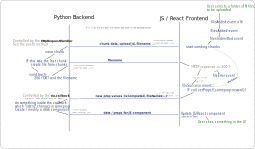

# CONTRIBUTING

## TABLE OF CONTENTS
- [1. How to improve this package?](#1-how-to-improve-this-package)
- [2. Setting up development environment](#2-setting-up-development-environment)
- [3. Package structure](#3-package-structure)
  - [3.1 Highlights of package structure](#31-highlights-of-package-structure)
  - [3.2 Other (Package structure)](#32-other-package-structure)
- [4. Developing](#4-developing)
  - [4.1 Developing the Python code](#41-developing-the-python-code)
- [5. Testing](#5-testing)
  - [5.1 Manually](#51-manually)
  - [5.2 With pytest (automatic tests)](#52-with-pytest-automatic-tests)
  - [5.3  Testing React components without python](#53--testing-react-components-without-python)
- [6. Creating new version to pip](#6-creating-new-version-to-pip)
- [7.  How does dash-uploader work internally?](#7--how-does-dash-uploader-work-internally)
- [8.  More help?](#8--more-help)
## 1. How to improve this package?

Maybe you already have an idea. If not, see if there are any open [issues](https://github.com/np-8/dash-uploader/issues) that need help. 
## 2. Setting up development environment
- Clone this repository. Change current directory to project root.
- Install [npm and Node.js (16.x)](https://nodejs.org) for building JS.
- Install the JS dependencies by running `npm install` on the project root. This will create `node_modules` directory.
- Build the NPM modules
```
 npm run build
```
- Create python virtual environment and activate it
- `pip install` this package in editable state with the `[dev]` flag.
```
python -m pip install -e <path_to_this_folder>[dev]
```
- **Note**: If you are using older `pip` version (< 20.3), you will have to use the `--use-feature 2020-resolver` option with the `pip install` command! (See: [Extras not getting installed when the package that includes the extras has already been installed](https://github.com/pypa/pip/issues/4957)). You can also just update your `pip` with `python -m pip install --upgrade pip`.  

## 3. Package structure

### 3.1 Highlights of package structure
```
dash_uploader/
  * python source code of this package
    __init__.py
  _build/
    * Auto-generated python & JS code
    * Do not edit these by hand!
      _imports_.py
      <Component>.py <-- for each component
      dash_uploader.min.js
      dash_uploader.min.js.map
      metadata.json
      package-info.json
    
devscripts/
  * used during "npm run build"
  
src/
  lib/
    * React components (The JS/React source code)

package.json
  * Defines JS dependencies
  * Defines npm scripts

usage.py
  * Example file
  * Run with `python usage.py`
```
### 3.2 Other (Package structure)
```
assets/
  * Assets just for the demo (usage.py)
index.html
  * Needed for testing (with npm run)
inst/
  * Some kind of intermediate storage for JS files 
    (before copying to dash_uploader)
  * Automatically generated with "npm run build"
node_modules/
  * JS dependencies
  * Automatically created by "npm install"
venv/
  * python dependencies (virtual environment)
  * Created with "python -m venv venv"
```
## 4. Developing

### 4.1 Developing the Python code

- Edit the non-auto-generated files in `dash_uploader` 
- The used code formatter is [black](https://github.com/psf/black).
### 4.2 Developing the React/JS code
- Edit the react.js files in `src/lib/components/`<br>


#### 4.2.1  Building: React.js -> JS & Python
If you edited the JS files, you need to build them. You also need to build the JS files the first time you try to use the cloned package. 

Run in the project root
```
npm run build
```
This will create all the auto-generated (JS, json, python) files into the `dash_uploader/_build` folder.
#### 4.2.2 Building: Updating the JS

Javascript libraries tend to get security fixes quite often. To fix the security issues, use 

```
npm install -g npm
npm audit fix
```

You also might find useful:

```
npm outdated
```

which lists the outdated packages and the latest versions. To update all packages to the "Wanted" version, use

```
npm update
```

To install a specific version of a package, use:

```
npm install <package>@<version>
```

This will also add the package (and version) in the `package.json`
## 5. Testing

### 5.1 Manually

You can test the code manually by running the demo page
1. Run `python usage.py`
2. Visit http://127.0.0.1:8050/ in your web browser

### 5.2 With pytest (automatic tests)

#### 5.2.1 Before trying to run pytest


- Make sure you have built the JS first with `npm run build`. 
- If you face any problems with running the tests, redo the steps described in *2. Setting up development environment* and make sure you have the correct virtual environment activated. 

#### 5.2.2 Running pytest
- You can test the code automatically by running 

```
python -m pytest
```

- The `app`  defined in the `usage.py` will be available to the tests. See the tests in the `tests/test_usage.py` to get a grasp on how it works. You could also add other `app`s available to the tests in similar manner.
- More about testing Dash components [here](https://dash.plotly.com/testing).


## 6. Creating new version to pip

*only applicable to people with access to the PyPI package*
- Update version in `package.json`
- Create new `dash_uploader-x.x.x.tar.gz` with 
```
python .\setup.py sdist
```
- Upload to pip with
```
twine upload .\dist\dash_uploader-x.x.x.tar.gz
```
## 7.  How does dash-uploader work internally?

Here is a diagram that tries to explain how dash-uploader works under the hood. If you find a place for improvement, please [submit a PR](https://github.com/np-8/dash-uploader/issues).


[](https://raw.githubusercontent.com/np-8/dash-uploader/master/docs/how-dash-uploader-works.svg)

## 8.  More help?
Read also the automatically generated README text at [README-COOKIECUTTER.md](README-COOKIECUTTER.md).